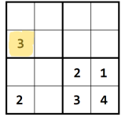

# Solucionador de sudoku
Resolvedor de sudoku con logica proposicional
* Completá el script c_n4.smt2 o c_n9.smt2 (en formato SMT-LIB)
para resolver el Sudoku usando [CVC5](<https://cvc5.github.io/app/>)

### Uso

Para *crear la config*  4x4(cn_4) o 9x9(cn_9) 
[(fila,columna,numero),(fila,columna,numero)...]

> Aca la casilla resaltada es [(2,1,3)...]

### Llamar al sudoku

sudoku (tamaño)(cn_4 o cn_9)

* El resultado lo pegamos en [CVC5](<https://cvc5.github.io/app/>)

### Interpretacion de resultados    

* Nos devuelve un formato (fila,columna,numero, true o false) 

* Cuando dice *true* en esa fila y columna va ese numero